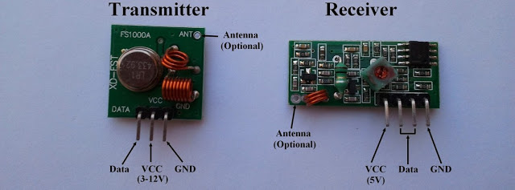
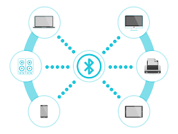

# PENSINYALAN

## Sinyal RF
 **RF (Radio Frekuensi)** adalah komponen yang dapat mendeteksi sinyal gelombang elektromagnetik digunakan oleh sistem komunikasi untuk mengirim informasi melalui udara dari satu titik ke titik lainnya yang merambat di antara antena pemancar pengirim dan penerima.

_Amplitudo_ mengindikasikan kekuatan sinyal dan ukuran yang biasanya berupa energi yang dianalogikan dengan jumlah usaha yang digunakan seseorang pada waktu mengendarai sepeda untuk mencapai jarak tertentu. Dalam konteksnya, sinyal gelombang elektromagnetik menggambarkan jumlah energi yang diperlukan untuk mendorong sinyal pada jarak tertentu yang mana ketika energi meningkat, jaraknya pun juga bertambah.

Radio Frekuensi mempunyai 2 perangkat elektronik untuk mengirimkan sinyal gelombang elektromagnetik yang terdapat pada perangkat _transmitter_ dan kemudian untuk menerima sinyal gelombang elektromagnetik tersebut yang terdapat pada perangkat _receiver_. 

## Bluetooth
**Bluetooth** adalah teknologi yang memungkinkan dua perangkat yang kompatibel, seperti telepon dan PC untuk berkomunikasi tanpa kabel dan tidak memerlukan koneksi saluran yang terlihat. Teknologi ini memberikan perubahan yang signifikan terhadap peralatan elektronik yang kita gunakan.

Bluetooth beroperasi dalam pita frekuensi 2,4 _GHz_ (antara 2.402 _GHz_ sampai 2.480 _GHz_) yang mampu menyediakan layanan komunikasi data dan suara secara _real-time_ antara host to host bluetooth dengan jarak jangkauan layanan yang terbatas. Bluetooth dapat berupa card yang bentuk dan fungsinya hampir sama dengan card yang digunakan untuk _wireless local area network (WLAN)_ dimana menggunakan frekuensi radio standar IEEE 802.11, hanya saja pada bluetooth mempunyai jangkauan jarak layanan yang lebih pendek dan kemampuan transfer data yang lebih rendah.

Pada dasarnya bluetooth diciptakan bukan hanya menggantikan atau menghilangkan penggunaan kabel didalam melakukan pertukaran informasi, tetapi juga mampu menawarkan fitur yang baik untuk teknologi _mobile wireless_ dengan biaya yang relatif rendah, konsumsi daya yang rendah, _interoperability_ yang menjanjikan, mudah dalam pengoperasian dan mampu menyediakan layanan yang bermacam-macam.

## Wi-Fi
_**WI-FI**_ adalah singkatan dari _“Wireless Fidelity”_ yaitu suatu teknologi komunikasi nirkabel yang memanfaatkan gelombang radio untuk menghubungkan dua perangkat atau lebih untuk dapat saling bertukar informasi. WIFI atau sering ditulis dengan _“Wi-Fi”_ ini pertama kali ditemukan oleh perusahaan NCR Corporation dan AT&T pada tahun 1991 untuk sistem kasir. Namun Saat ini, teknologi WIFI ini telah banyak digunakan pada perangkat mobile seperti Smartphone dan Laptop hingga ke perangkat elektronik lainnya seperti Televisi, DVD Player, Digital Kamera, Printer, Konsol Game dan bahkan lebih luas lagi hingga ke perangkat rumah tangga lainnya seperti Lampu, Kulkas dan Pengatur Suhu (AC).

WiFi adalah Jaringan Area Lokal atau LAN _(Local Area Network)_ yang tidak memerlukan kabel dengan koneksi kecepatan yang tinggi. WiFi sering disebut juga dengan WLAN atau _Wireless Local Area Network_. Teknologi WiFi ini menggunakan dua frekuensi gelombang radio dalam mengirimkan dan menerima sinyal Radio. Kedua Frekuensi gelombang radio tersebut adalah Frekuensi 2,4GHz dan 5GHz.

Jarak jangkauan sebuah router WiFi atau Hotspot WiFi dalam ruangan adalah sekitar 30 meter namun dapat lebih luas lagi apabila di luar ruangan. Pada umumnya, kecepatan koneksi juga sangat tergantung pada kedekatan perangkat penerima dengan sumber sinyal radionya. Koneksi WiFi akan meningkat apabila perangkat pengguna berada di dekat router atau titik hotspotnya. Sebaliknya, koneksi sinyal WiFi akan semakin lambat apabila berada di wilayah yang jauh dari sumber sinyalnya.

Jaringan WiFi 802.11
Ada dua jenis jaringan WLAN yang dapat dibentuk dengan menggunakan sistem WiFi. Kedua jaringan tersebut adalah jaringan infrastruktur dan jaringan ad-hoc.

1. Jaringan Infrastruktur (Infrastructure Network)
Aplikasi jaringan infrastruktur ini ditujukan untuk perkantoran atau untuk menyediakan “hotspot”. Peralatan WLAN diinstalasi sebagai pengganti sistem kabel sehingga dapat memberikan penghematan biaya yang cukup besar. Jaringan kabel backbone masih tetap diperlukan dan terhubung ke server. Jaringan nirkabel kemudian dipecah menjadi beberapa bagian yang disebut dengan sel, masing-masing dilayani oleh Stasiun Pangkalan (Base Station) atau Access Point (AP) yang bertindak sebagai pengendali untuk sel yang bersangkutan. Setiap Access Point dapat memiliki jangkauan antara 30 dan 300 meter tergantung pada lingkungan dan lokasi Access Point.

2. Jaringan Ad-Hoc
Jenis jaringan lain yang dapat digunakan disebut jaringan Ad-Hoc. Jaringan ini terbentuk ketika sejumlah komputer dan periferal (contohnya printer dan scanner) pada suatu lokasi ingin dihubungkan bersama antara satu dengan yang lainnya. Hubungan sejumlah komputer atau perangkat periferal ini mungkin diperlukan ketika beberapa orang sedang berkumpul dan memerlukan aktivitas berbagi data,  atau juga perlu mengakses printer tanpa harus menggunakan koneksi kabel. Dalam situasi ini para pengguna hanya berkomunikasi antara satu sama lainnya dan tidak dengan jaringan kabel yang lebih luas. Jaringan Ad-Hoc ini tidak perlu menggunakan Titik Akses (Access Point) dan algoritma khusus dalam protokol.

